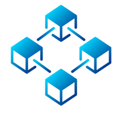

### Hello friend 👋

- 🔭 I’m currently in my **first year of Masters in Computer and Embedded Systems Engineering** at TU Delft, Netherlands  
- I have a bachelor in computer science from Université de Strasbourg, France.
- 🌱 I’m currently learning about Visible Light Communication, Networking, and Security and Cryptography
- I am working as a part time embedded developper at Sentistic 
- 📫 How to reach me: *aki.schmatzler@gmail.com*  

### My go-to's :  

	
	  
	  

### Other languages/technologies I've used or learnt about and that I like :

	  
	  
	  
	  
	  
	  
	  

Feel free to ask me anything about my different repositories :)
